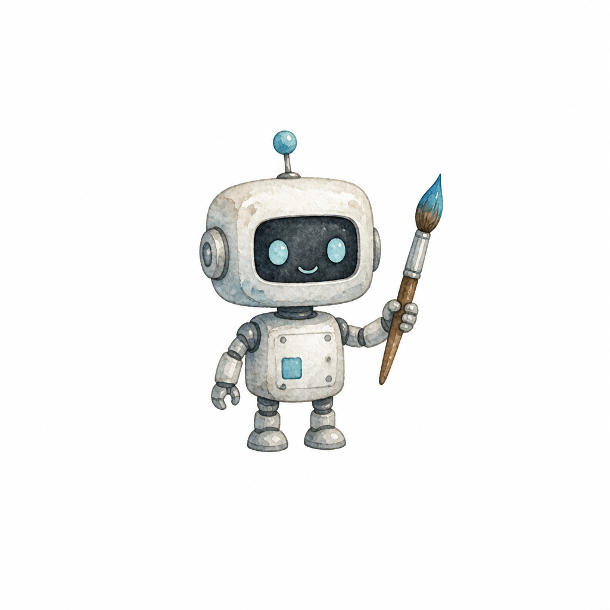
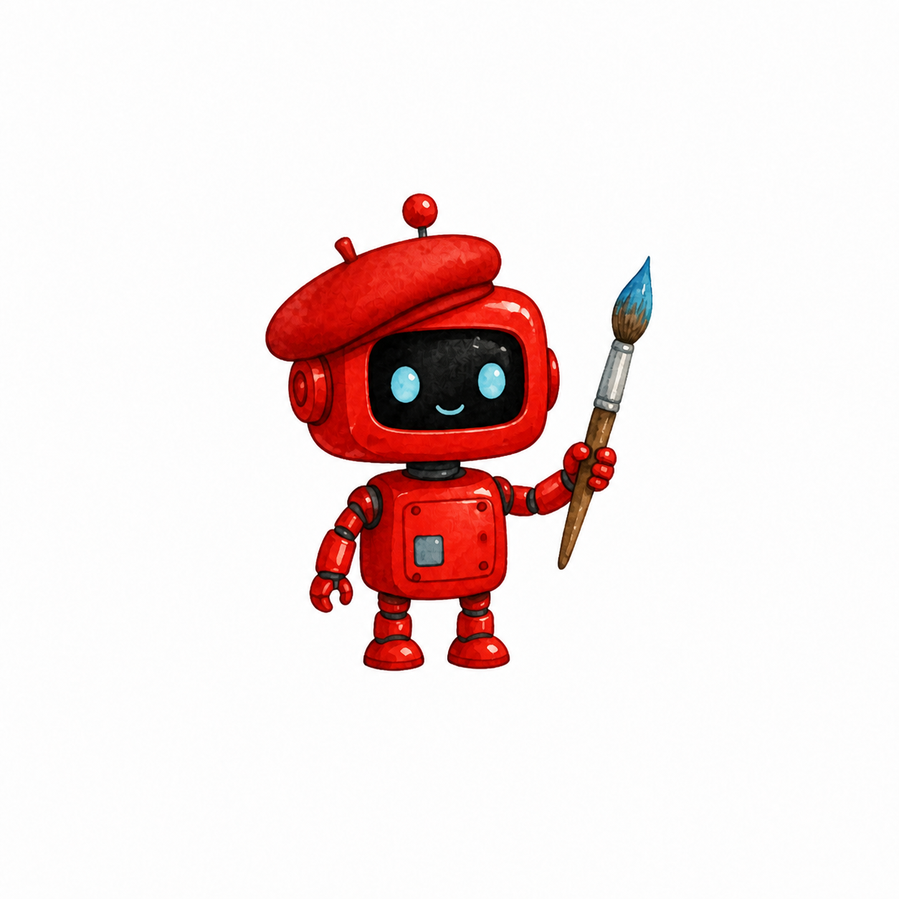

# imagegen

A fast, agent-friendly CLI for OpenAI image generation and editing, built around
**gpt-image-2**. Written in Rust, MIT licensed.

```bash
imagegen generate "a tiny watercolor robot holding a paintbrush" -o robot.png
imagegen edit "make the robot bright red and give it a beret" -i robot.png -o robot-red.png
```

| generate | edit |
|---|---|
|  |  |

Both images above were produced by the two commands shown, unretouched.

## Why does my coding agent need to generate images?

Because agents build things that need images, constantly: hero images and og:images
for the landing page they just scaffolded, placeholder product photos for the demo,
icons and logos for the prototype, textures for the game jam entry, illustrations
for the docs, test fixtures for the image pipeline. Without a tool for it, an agent
either stops to ask you for assets or ships gray rectangles.

And the best interface to give an agent is a boring, generic CLI. CLIs compose with
everything an agent already knows: pipes, loops, exit codes, `$(...)`. This tool
leans into that:

- **Paths on stdout, progress on stderr** — `mv $(imagegen gen "..." --quiet) site/hero.png` just works.
- **`--json`** for structured results: absolute paths, byte sizes, token usage.
- **Stable exit codes** so scripts and agents can branch: `0` success, `1` API error,
  `2` auth, `3` moderation, `4` bad input.
- **A [Claude Code skill](skill/SKILL.md)** that teaches the agent when and how to
  use it (quality/cost tradeoffs, sizes, editing, recipes).

## Install

Homebrew (macOS / Linux):

```bash
brew tap chrischabot/imagegen
brew trust chrischabot/imagegen   # Homebrew ≥ 6 requires trusting third-party taps
brew install imagegen
```

Or with cargo:

```bash
cargo install --git https://github.com/chrischabot/imagegen-cli
```

Or from a checkout: `cargo install --path .`

### Teach it to Claude Code (or Codex)

```bash
# Claude Code
mkdir -p ~/.claude/skills/imagegen
cp skill/SKILL.md ~/.claude/skills/imagegen/SKILL.md

# Codex CLI (same skill format)
mkdir -p ~/.codex/skills/imagegen
cp skill/SKILL.md ~/.codex/skills/imagegen/SKILL.md
```

From then on, asking the agent for "a hero image for this page" or "make the
logo red" will use `imagegen` with sensible flags. (For project-local installs
use `.claude/skills/imagegen/` in the repo instead.)

## Authentication

Pass `--api-key sk-...`, or set the `OPENAI_API_KEY` environment variable
(the flag wins when both are present).

> **Why not ChatGPT/Codex logins?** ChatGPT OAuth tokens are scoped to the
> ChatGPT backend, not the platform API, so they can't be used for
> `/v1/images`. A platform API key is required.

`gpt-image-2` requires [organization verification](https://help.openai.com/en/articles/10910291-api-organization-verification)
on your OpenAI account. If you can't verify, use `-m gpt-image-1.5`.

## Usage

### Generate

```bash
imagegen generate "minimal flat vector banner, mountains at sunrise" \
  -q low -s 1280x768 -f jpeg -c 80 -o banner/
```


```
Usage: imagegen generate [OPTIONS] <PROMPT>   (alias: gen)

  -m, --model <MODEL>              gpt-image-2 (default), gpt-image-1.5, gpt-image-1, gpt-image-1-mini
  -s, --size <SIZE>                WIDTHxHEIGHT or 'auto' (default)
  -q, --quality <QUALITY>          auto (default), low, medium, high
  -f, --format <FORMAT>            png (default), jpeg, webp
  -c, --compression <0-100>        compression for jpeg/webp
  -b, --background <BACKGROUND>    auto, opaque, transparent
      --moderation <MODERATION>    auto (default), low
  -n, --n <1-10>                   number of images
  -o, --out <PATH>                 output file or directory
      --json                       machine-readable output
      --quiet                      suppress progress on stderr
      --api-key / --base-url / --timeout
```

Output paths: with no `-o`, files are auto-named from the prompt and timestamp in
the current directory (`neon-city-at-night-20260704-195806.png`). `-o dir/` puts
auto-named files there; `-o file.png` names it exactly; with `-n 3` you get
`file-1.png`, `file-2.png`, `file-3.png`.

### Edit

```bash
# restyle
imagegen edit "make it look like a pencil sketch" -i photo.png -o sketch.png

# combine references
imagegen edit "the robot painting the mountain scene" -i robot.png -i banner.jpeg -o mashup.png

# inpaint with a mask (transparent pixels = region to replace)
imagegen edit "replace with a bookshelf" -i room.png --mask hole.png -o out.png

# preserve input details more/less closely (gpt-image-1/1.5 only; gpt-image-2 is always high)
imagegen edit "..." -i in.png --fidelity high
```

### Models

```bash
imagegen models          # list image-capable models on your key
imagegen models --json
```

### JSON output

```bash
imagegen gen "a red circle" -q low --json
```

```json
{
  "model": "gpt-image-2",
  "operation": "generate",
  "elapsed_seconds": 18.0,
  "size": "1024x1024",
  "quality": "low",
  "output_format": "png",
  "background": "opaque",
  "usage": {
    "input_tokens": 17,
    "output_tokens": 196,
    "total_tokens": 213
  },
  "images": [
    { "path": "/abs/path/a-red-circle-20260704-195806.png", "bytes": 899573, "revised_prompt": null }
  ]
}
```

## gpt-image-2 cheat sheet

- **Sizes**: any `WIDTHxHEIGHT` where both edges are multiples of 16, the longest
  edge is ≤ 3840, aspect ratio ≤ 3:1, and total pixels are between 655,360 and
  8,294,400. Popular: `1024x1024`, `1536x1024`, `1024x1536`, `2048x1152`,
  `3840x2160`. Square renders fastest. The CLI warns before sending a size the
  model will reject.
- **Quality vs cost** (1024×1024, token-based pricing): low ≈ $0.006, medium ≈
  $0.053, high ≈ $0.211. Draft at `low`, finalize at `medium`/`high`.
- **No transparent backgrounds** — use `-m gpt-image-1.5 -b transparent` for that.
- **Edits are always high fidelity** — input images are preserved closely by default.
- **Moderation blocks exit with code 3.** Rephrase the prompt instead of retrying.

## Exit codes

| Code | Meaning |
|---|---|
| 0 | success |
| 1 | API or network error |
| 2 | missing or invalid credentials |
| 3 | blocked by moderation |
| 4 | invalid arguments or missing input file |

## Development

```bash
cargo test            # unit tests (no network)
cargo clippy --all-targets
cargo build --release
```

Live smoke test (spends ~$0.01): `cargo run --release -- gen "a red circle" -q low`

## License

[MIT](LICENSE)
